# Visual Studio for Mac

## Tutorial de Instalação

### Pré-requisitos

Para a instalação do Visual Studio for Mac com Xamarin, é necessário alguns pré-requisitos:

- Um Mac com **macOS Sierra 10.12** ou superior
- **Xcode 8.3** ou superior
- Um **Apple ID**. Se não possuir um, crie-o em [https://appleid.apple.com](https://appleid.apple.com/). É necessário ter um Apple ID para instalar e logar no Xcode.

### Instalação

1. Baixe o instalador do Visual Studio for Mac de [https://www.visualstudio.com/vs/visual-studio-mac/](https://www.visualstudio.com/vs/visual-studio-mac/).

2. Uma vez baixado o arquivo, clique no arquivo **VisualStudioInstaller.dmg** e monte o instalador. Em seguida, dê um duplo-clique no ícone do instalador como mostrado abaixo:

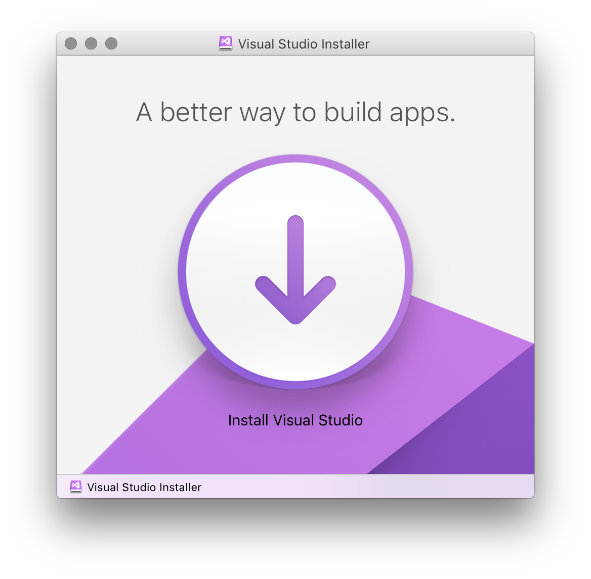

3. Se você for alertado da execução do arquivo, clique em **Abrir**:

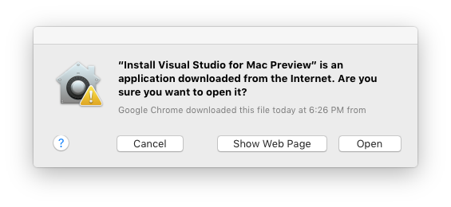

4. O instalador vai inspecionar seu sistema para verificar quais componentes precisam ser instalador ou atualizados:

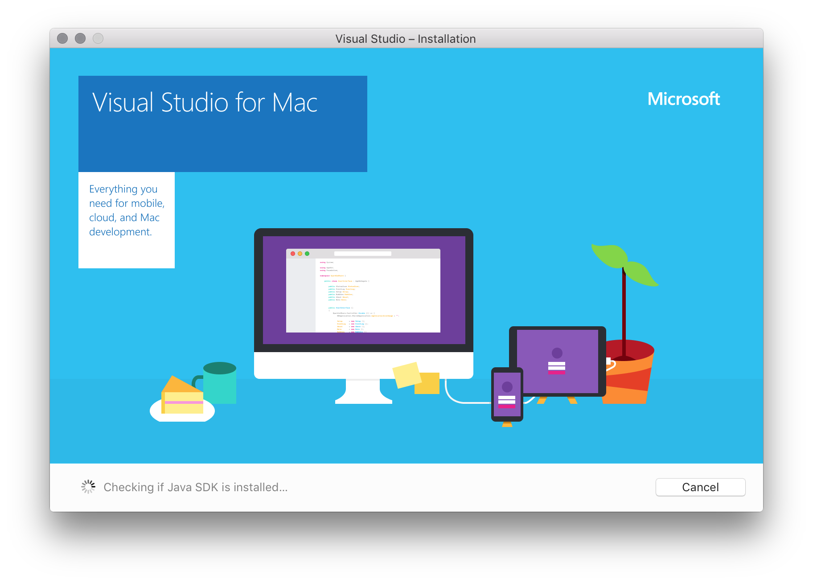

5. Uma mensagem de diálogo deve aparecer lhe pedindo para aceitar os termos de Licença e Privacidade. Pressione **Continue** para aceitar os termos:

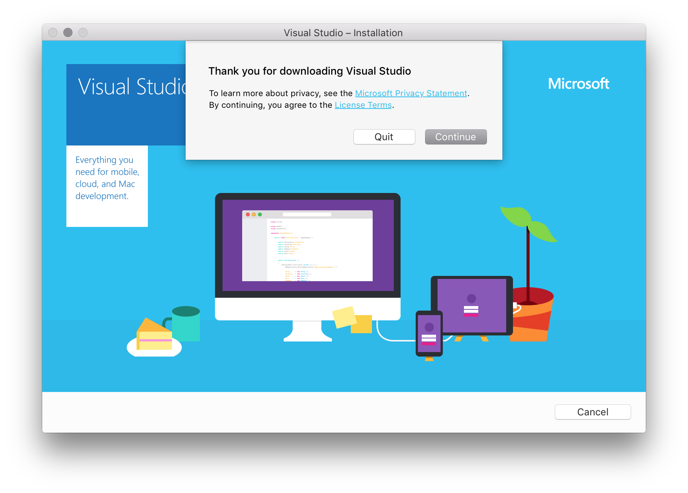

6. O instalador irá apresentar uma lista de componentes que podem ser inseridos na sua instalação. Selecione todos os items como ilustrado:

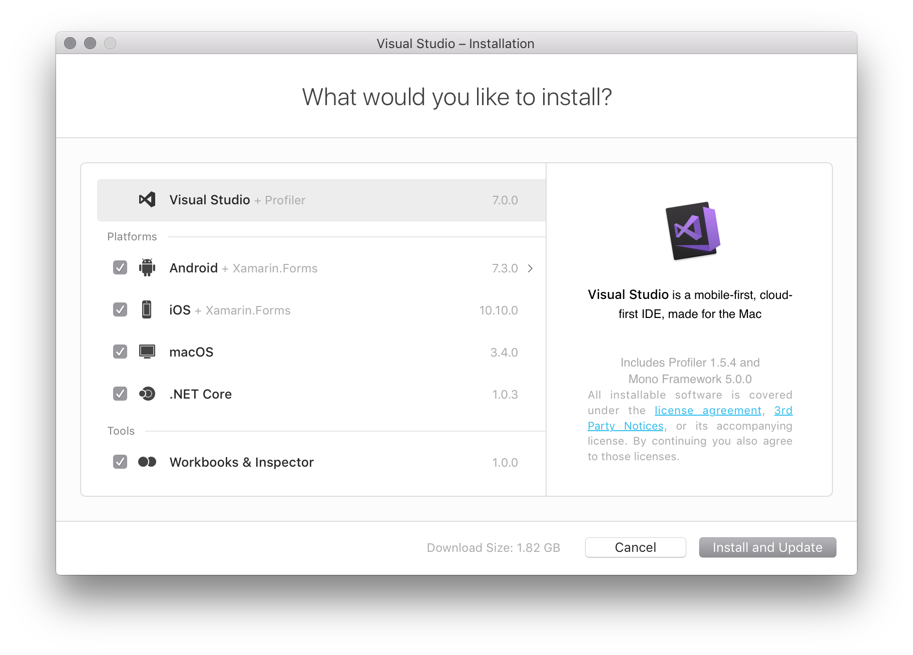

A tela de instalação mostra as versões e tamanhos de cada componente individual. Você pode clicar em cada componente para mostrar uma lista de dependências para cada, ver pacotes adicionais que ele baixa ou ver aplicações adicionais requeridas.

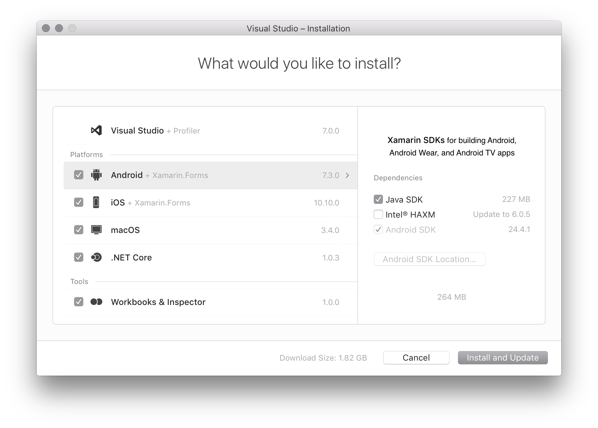

7. Uma vez finalizadas as seleções, clique em **Install and Update** para iniciar o processo de instalação.

8. O instalador inicia o download e o processo de instalação de cada item selecionado anteriormente:

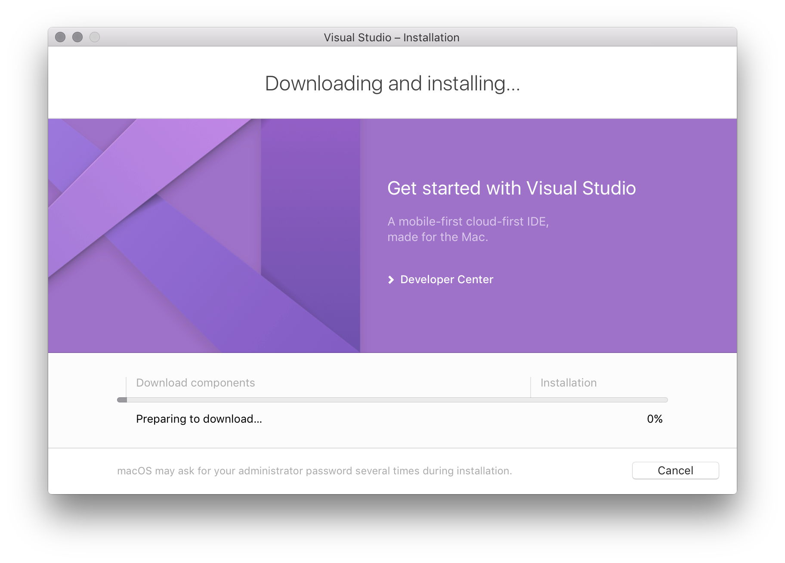

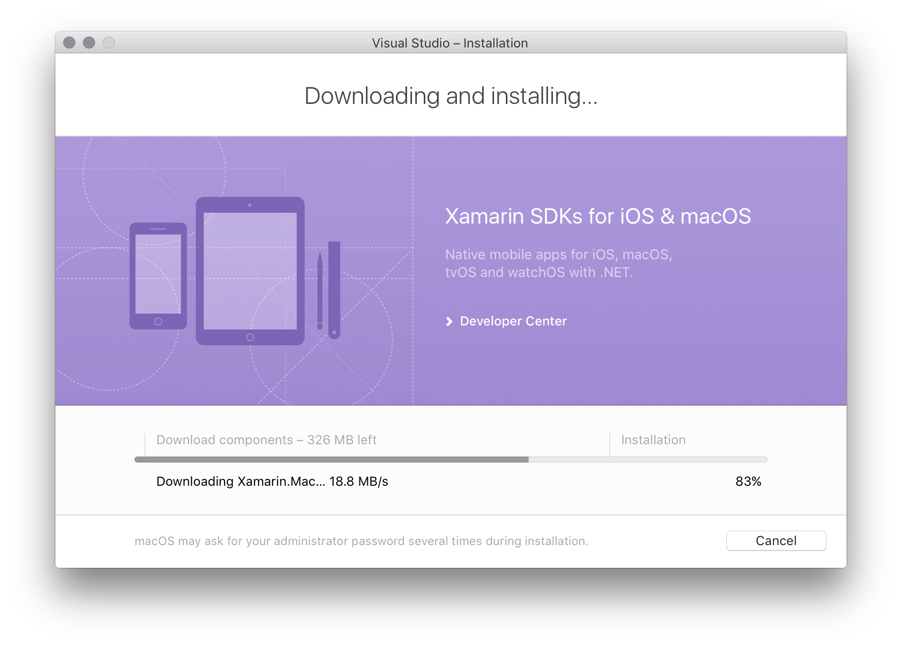

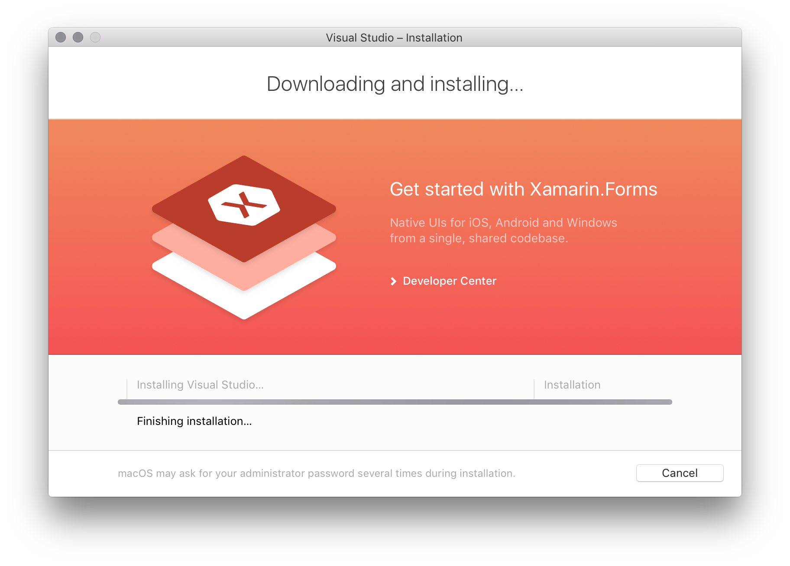

9. Talvez sejam requisitados permissões de administrador para algum componente. Insira suas credenciais, caso necessário, para continuar o processo de instalação:

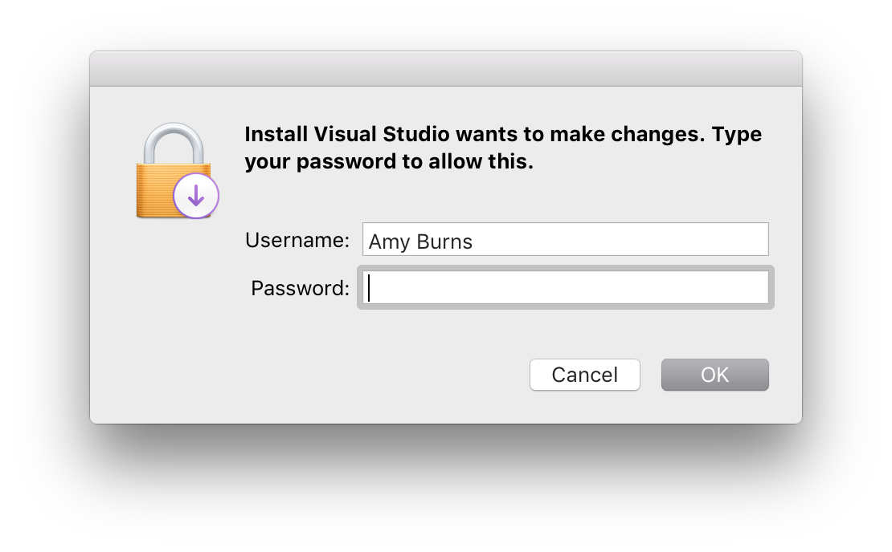

10. Uma vez que a instalação finalizar, você pode começar a desenvolver aplicações pressionando em **Start**.

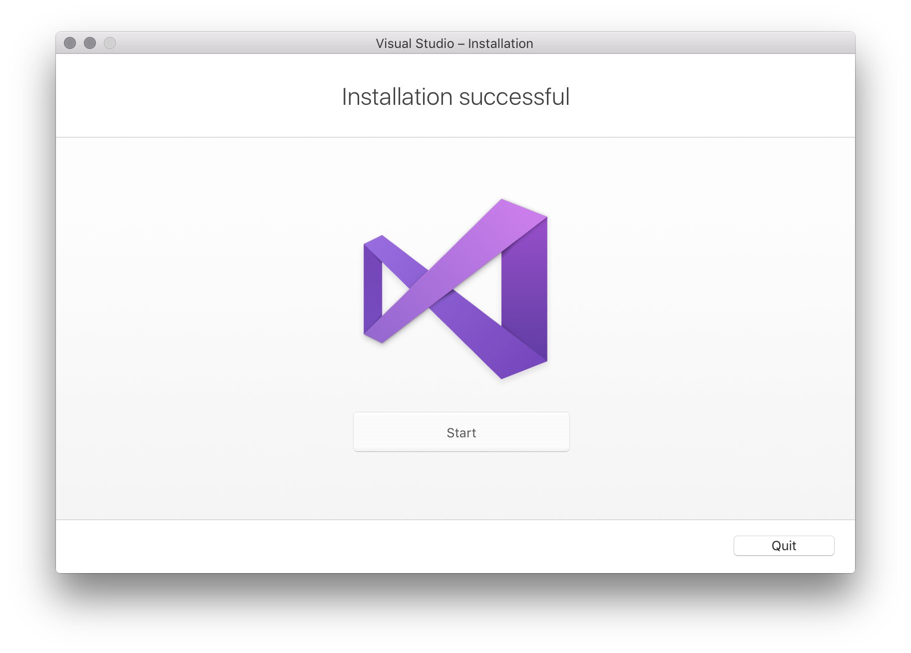

### Observação

Se você deseja instalar um componente adicional que não foi selecionado durante o processo de instalação inicial, rode o instalador novamente e selecione o(s) componente(s) desejado(s).