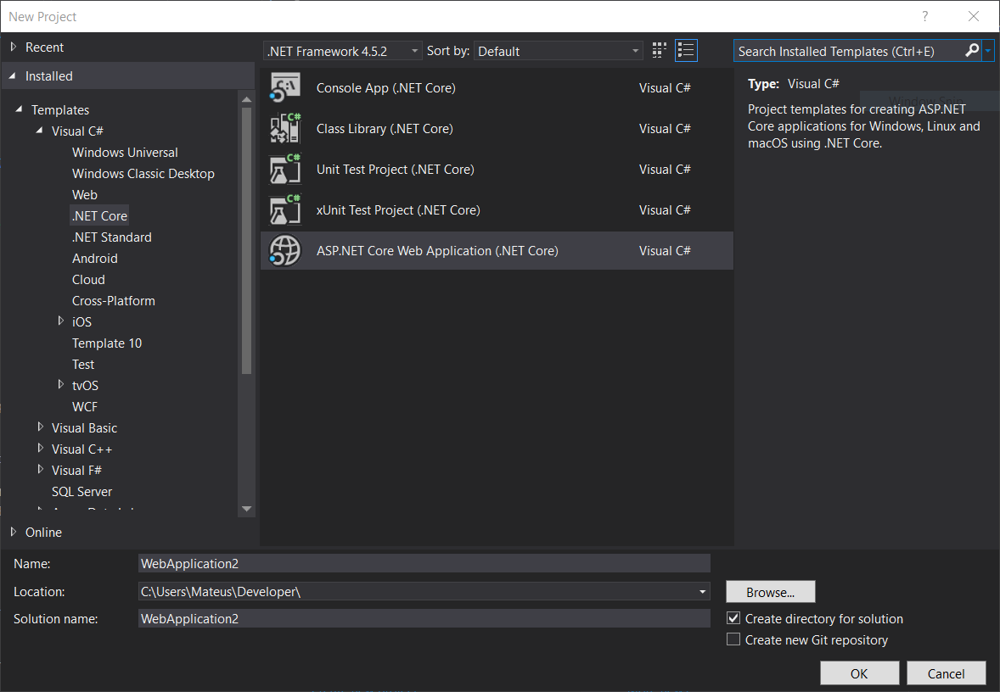
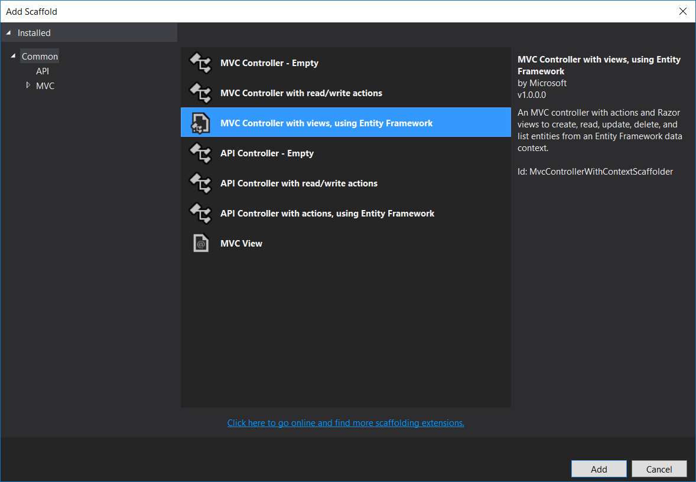

# 02 - Introdução ao ASP.NET Core

## Passo-a-passo

### Criando a aplicação no console

Esse método de interação com o ASP.NET Core pode ser realizado de qualquer plataforma (Windows, Mac ou Linux).

1. Baixar o SDK via [dot.net](http://dot.net)
2. Ir para uma pasta de sua preferência e criar o projeto rodando o seguinte comando:

```
dotnet new mvc --auth individual --output <nome_do_projeto>
```

3. Entrar na pasta onde o projeto foi criado. A pasta possui o mesmo nome que você inseriu no --output:

```
cd <nome_do_projeto>
```

4. Restaurar as dependências de projeto:

```
dotnet restore
```

5. Iniciar o servidor web e acessar a aplicação ASP.NET Core via browser:

```
dotnet run
```

### Criando a aplicação no Visual Studio

Esse método, como descrito nesse tutorial, só pode ser realizado no Visual Studio para Windows. O Visual Studio for Mac também suporta ASP.NET Core, porém os passos a serem seguidos são levemente diferentes.

1. Crie um novo projeto pelo menu File -> New -> Project

2. No menu de templates, selecione *.NET Core* ao lado esquerdo e, na lista que segue, selecione *ASP.NET Core Web Application (.NET Core)*.



3. Dê um nome a sua aplicação e clique em OK.

4. Na caixa de diálogo que abre, selecione o template *Web Application*. Nas opções de autenticação (no botão *Change Authentication*), selecione *Individual User Accounts* e clique em OK.


5. Abra o arquivo *appsettings.json* e modifique o nome do banco de dados na ConnectionString para um nome mais amigável, por exemplo:

```
"DefaultConnection": "Server=(localdb)\\mssqllocaldb;Database=MyAppDB;Trusted_Connection=True;MultipleActiveResultSets=true"
```

6. Dentro da pasta *Models*, crie uma nova classe chamada Tarefa, que representará a entidade de tarefas do nosso banco de dados. Para criar a classe, clique com o botão direito em *Models*, depois em *Add*, depois em *Class*. No diálogo que abre, clique em *ASP.NET Core* do lado esquerdo e clique em *Classe* na lista.


7. Após criado nosso primeiro model, abra a classe de contexto do banco de dados para inserir nossa nova classe à lista de modelos da nossa aplicação. Para isso, vá para a pasta *Data*, depois abra o arquivo *ApplicationDbContext.cs*. Insira o item da linha 13 ao seu arquivo.


#### OBS: Os próximos passos nós fizemos com o PowerShell integrado ao Visual Studio. Nesse tutorial, vamos fazer na linha de comando para que vocês aprendam essa outra maneira de fazer. Como não dependemos mais do PowerShell, esses comandos também valem para Mac e Linux.

8. Clique com o botão direito em cima do projeto -- e não da solução -- e clique em *Open Folder in File Explorer*.

9. Quando o Windows Explorer aparecer, digite *cmd* na barra de endereços e pressione Enter.


10. Com a linha de comando aberta, digite os seguintes comandos:

```
dotnet ef migrations add CriarTarefa
```
Esse comando cria um novo arquivo de Migrations para ser aplicado ao banco de dados.

*CriarTarefa* é um nome arbitrário e pode ser qualquer um de sua escolha.

```
dotnet ef database update
```

Esse comando executa os arquivos de Migration e atualiza o esquema do banco de dados.


11. Com isso realizado, vamos voltar ao Visual Studio e criar um novo Controller com Views para a entidade Tarefa que criamos. Clique com o botão direito na pasta *Controllers*, clique em Add -> New Scaffolded Item. Selecione a opção *MVC Controller with views, using Entity Framework*.



12. No diálogo que surge, digite *Tarefa* no *Model Class* e abra o drop-down de *Data context class* para selecionar nosso contexto, que é *ApplicationDbContext*. O preenchimento deve ficar similar ao da imagem:


13. Clique em *Add* e aguarde o processo concluir.

14. Rode o projeto em Debug -> Start Debugging ou Ctrl + F5. Ao abrir o navegador, complete o endereço com o nome do controller que foi criado. Ex: http://localhost:44320/Tarefas se o nome do seu controller foi TarefasController. Ou seja, o nome na rota é sempre o antecedente à palavra 'Controller' do nome do arquivo do controller.

